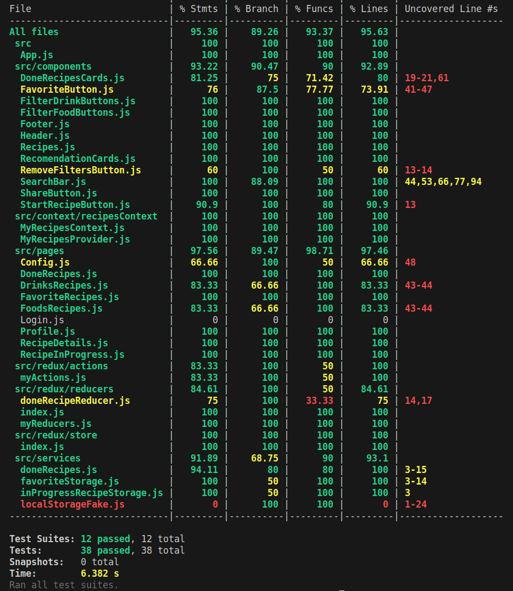

<h1 align="center">Boas-vindas ao repositório do Recipes App!</h1>

<h2 align="center">
  <a href="https://h3zord.github.io/recipes-app" target="_blank">
    Aplicação
  </a>
</h2>
<br/>

## Objetivo

<strong>Recipes App</strong> é um projeto em grupo de quatro integrantes que desenvolveram um aplicativo de receitas para dispositivos móveis. Durante o desenvolvimento, o grupo trabalhou tanto individualmente quanto em pair programming. As receitas apresentadas são obtidas de uma API externa.

<h2 align="center">Demonstração</h2>
<br/>

<div align="center">

https://user-images.githubusercontent.com/102384026/226144581-5e9987c0-a507-44c3-828c-82d947020380.mp4

</div>

<br/>
<br/>

## O que foi desenvolvido?

O projeto <strong>Recipes App</strong> é um aplicativo de receitas para dispositivos móveis desenvolvido por um grupo de quatro integrantes, que trabalharam individualmente e em pair programming. As receitas foram obtidas de uma API externa e o projeto foi organizado com reuniões diárias pelo Zoom, planejamento pelo Trello e comunicação assíncrona pelo Slack, além do controle de versões feito pelo Git.

O aplicativo foi construído com React, utilizando as ferramentas React Hooks, Context API e Redux para controlar o estado global da aplicação, e a estilização foi feita com CSS e Bootstrap. Os testes foram realizados com as bibliotecas Jest, Mocha e React Testing Library, alcançando uma cobertura de testes de cerca de 90%.

A página principal do aplicativo contém ícones para comidas e drinks, um botão de busca, botões de filtro e um botão de perfil com preferências do usuário. Ao clicar em um card da receita, o usuário é direcionado para a página de detalhes, onde é possível favoritar e copiar o link da receita, visualizar os ingredientes e o modo de preparo. A página também permite acompanhar o progresso da receita e marcar os ingredientes usados, finalizando a receita. As informações são armazenadas no local storage.

## Linguagens e ferramentas:
- HTML
- CSS
- Javascript
- React
- Context API
- Redux
- Bootstrap
- Jest
- Mocha
- React Testing Library

## Instalação e execução

### 1 - Clone o repositório:
```
git@github.com:h3zord/recipes-app.git
```

### 2 - Entre no repositório:
```
cd recipes-app
```

### 3 - Instale as dependências:
Caso utilize o npm
```
npm install
```
Caso utilize o yarn
```
yarn install
```

### 4 - Inicie o projeto:
Caso utilize o npm
```
npm start
```
Caso utilize o yarn
```
yarn start
```

## Execução dos testes

### 1 - Rode o script:
Caso utilize o npm
```
npm run test:coverage
```
Caso utilize o yarn
```
yarn test:coverage
```

<h2 align="center">Cobertura de testes</h2>
<br />

<div align="center">
  
</div>
<br />
